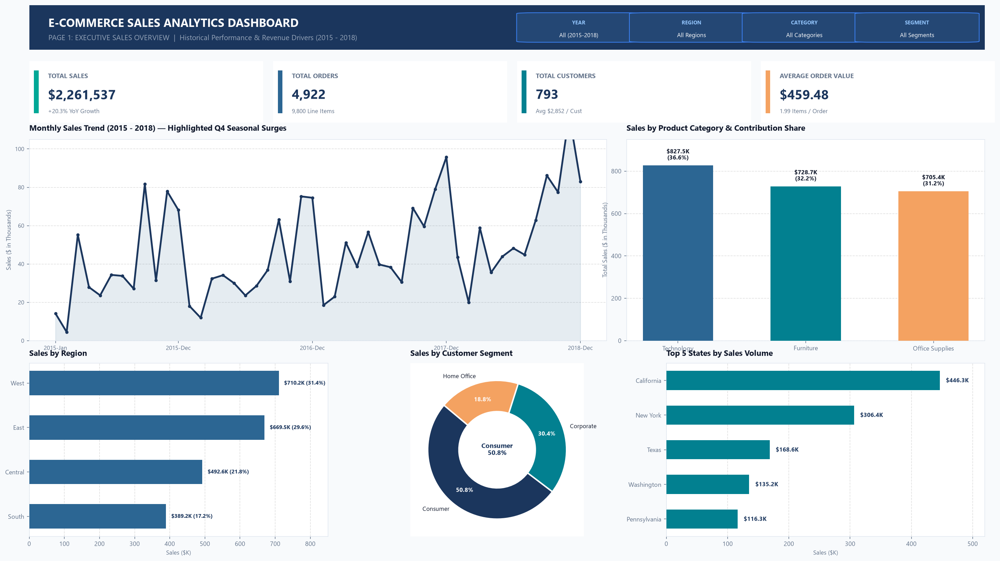
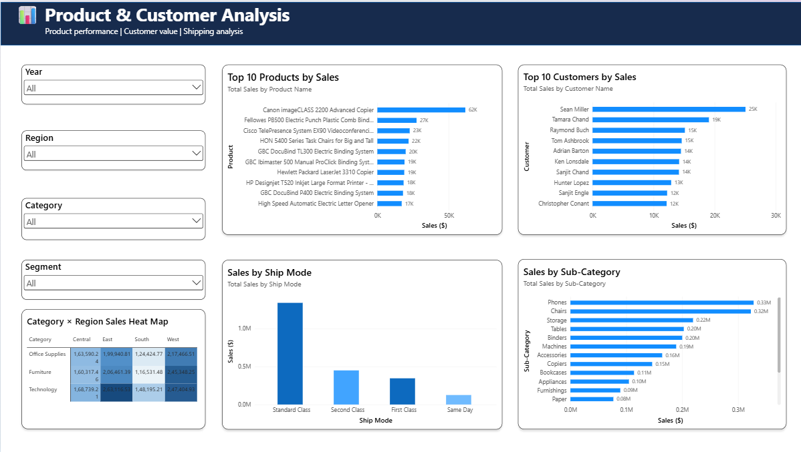

# 🛒 E-Commerce Sales Analysis Dashboard

An end-to-end data analytics portfolio project transforming raw e-commerce transaction records into verified business intelligence through **Python (Pandas, NumPy, Matplotlib, Seaborn)**, **SQL (MySQL 8.0+)**, and **Power BI**.

---

## 📖 Project Overview

This project analyzes historical retail transaction data from a US-based e-commerce store operating across 49 states. The objective is to identify revenue trends, analyze customer purchasing behavior, evaluate product category performance, compare regional sales, and deliver data-backed business insights.

The project follows a structured data pipeline — from data cleaning and exploratory analysis in Python, to advanced SQL analytics in MySQL, to data modeling and dashboard prototyping in Power BI.

---

## 🎯 Business Objectives

1. Analyze sales trends over time.
2. Identify the best-performing categories and products.
3. Compare sales across regions and states.
4. Understand customer segment performance.
5. Identify important business insights from the data.

---

## 📂 Dataset

The analysis is based on the cleaned transactional dataset ([`data/sales_cleaned.csv`](data/sales_cleaned.csv)), containing **9,800 rows** and **22 columns**.

| Attribute | Details |
| :--- | :--- |
| **Rows** | 9,800 transactions |
| **Orders** | 4,922 unique orders |
| **Customers** | 793 unique customers |
| **Products** | 1,861 unique SKUs |
| **Categories** | Technology, Furniture, Office Supplies (17 sub-categories) |
| **Date Range** | 2015-01-03 to 2018-12-30 (4 years) |
| **Regions** | West, East, Central, South (49 states) |
| **Total Sales** | $2,261,536.78 |

> [!NOTE]
> No unverified Profit metric has been fabricated. The analysis uses only verified gross Sales data from the dataset.

---

## 🔄 Project Workflow

```
Raw Data (sales.csv)
    ↓
Data Cleaning (Python / Pandas)
    ↓
Exploratory Data Analysis (Python / Matplotlib / Seaborn)
    ↓
SQL Analytics (MySQL 8.0+)
    ↓
Power BI Data Model & Dashboard
    ↓
Business Insights
```

---

## 🛠️ Technologies Used

| Category | Tools |
| :--- | :--- |
| **Data Processing** | Python, Pandas, NumPy |
| **Visualization** | Matplotlib, Seaborn |
| **Database & SQL** | MySQL 8.0+ |
| **Business Intelligence** | Power BI Desktop, DAX, Power Query (M) |
| **Environment** | Jupyter Notebook, Git, GitHub |

---

## 🔬 Implementation Phases

### 🟩 Phase 1 — Data Cleaning ✅

Performed in Python ([`notebook/sales_analysis.ipynb`](notebook/sales_analysis.ipynb)):
* Identified 11 missing `Postal Code` entries (Burlington, Vermont) — preserved as `NULL` without synthetic imputation.
* Converted `Order Date` and `Ship Date` to proper datetime formats.
* Created new columns: `Year`, `Month`, `Month Name`, and `Year-Month` for time-based analysis.
* Exported the cleaned dataset as [`data/sales_cleaned.csv`](data/sales_cleaned.csv) (9,800 rows × 22 columns).

---

### 🟨 Phase 2 — Exploratory Data Analysis (EDA) ✅

Conducted in Python with Matplotlib and Seaborn:
* Analyzed sales distributions (Mean: **$230.77**, Median: **$54.49**, Max: **$22,638.48**).
* Identified strong Q4 seasonal sales peaks in November and December.
* Found that Consumer segment accounts for **50.8%** of all transactions.

---

### 🟦 Phase 3 — Python Business Analysis ✅

Key findings from Python EDA:
* Revenue grew from **$479,856** (2015) to **$722,052** (2018) — a **+50.5%** increase.
* November and December consistently generate the highest monthly sales.
* The West region leads with **31.4%** of total sales.

---

### 🟧 Phase 4 — SQL Analytics ✅

Used MySQL to analyze the cleaned sales data and answer important business questions. The [`sql/`](sql/) folder contains 13 analytical scripts.

The analysis covered:
* Sales and order KPIs
* Yearly and monthly sales trends
* Category and sub-category performance
* Regional and state-level performance
* Customer segmentation and top customer analysis
* Product performance and ranking
* Shipping mode analysis
* Advanced SQL analysis using CTEs and window functions

*For detailed SQL documentation, see [`sql/README.md`](sql/README.md).*

---

### 🟪 Phase 5 — Power BI Data Model & Dashboard

The Power BI data model has been created and saved in **Microsoft Power BI Desktop** ([`dashboard/sales_dashboard.pbix`](dashboard/sales_dashboard.pbix)).

#### Completed:
* **Data Import**: Loaded all 9,800 rows from [`data/sales_cleaned.csv`](data/sales_cleaned.csv).
* **DateTable**: Created a dedicated DAX Calendar table (2015–2018).
* **Relationship**: Established `DateTable[Date]` → `sales_cleaned[Order Date]` (1-to-many).
* **KPI Measures**: Created `Total Sales`, `Total Orders`, `Total Customers`, and `Average Order Value`.

#### Dashboard Visual Build — In Progress:
* **Page 1: Executive Sales Overview** — KPI cards, sales trend, category chart, region chart, segment chart, Top 5 states, slicers.
* **Page 2: Product & Customer Analysis** — Top 10 products, Top 10 customers, sub-category breakdown, shipping mode chart.

*Supporting DAX measures, M code, and theme files are available in [`docs/power_bi/`](docs/power_bi/).*

---

## 📸 Dashboard Previews (Design Prototypes)

### Page 1: Executive Sales Overview


### Page 2: Product & Customer Analysis


---

## 📈 Key Business Insights

1. **Sales Growth**: Sales increased from about $480K in 2015 to $722K in 2018, showing strong overall business growth.

2. **Top Category**: Technology was the highest-performing category, contributing about 36.6% of total sales, followed by Furniture and Office Supplies.

3. **Top Region & Segment**: The West region generated the highest sales at about 31.4%, while the Consumer segment contributed the largest share of sales at about 50.8%.

---

## 🚀 How to Run the Project

### 1. Python
```bash
git clone https://github.com/siva252005/ecommerce-sales-analysis.git
cd ecommerce-sales-analysis
pip install pandas numpy matplotlib seaborn jupyter
jupyter notebook notebook/sales_analysis.ipynb
```

### 2. MySQL
1. Open MySQL CLI or MySQL Workbench.
2. Run [`sql/01_database_setup.sql`](sql/01_database_setup.sql) to create the database and table.
3. Load data from [`data/sales_cleaned.csv`](data/sales_cleaned.csv).
4. Run scripts `02` through `13` to reproduce the analysis.

### 3. Power BI
1. Open [`dashboard/sales_dashboard.pbix`](dashboard/sales_dashboard.pbix) in **Power BI Desktop**.
2. Explore the data model, DateTable relationship, and DAX measures.
3. See [`docs/power_bi/README.md`](docs/power_bi/README.md) for dashboard design specifications.

---

## 📌 Conclusion

This project demonstrates a complete data analytics workflow — from data cleaning in Python, to business analysis in MySQL, to data modeling in Power BI — transforming raw transaction records into verified business insights.
